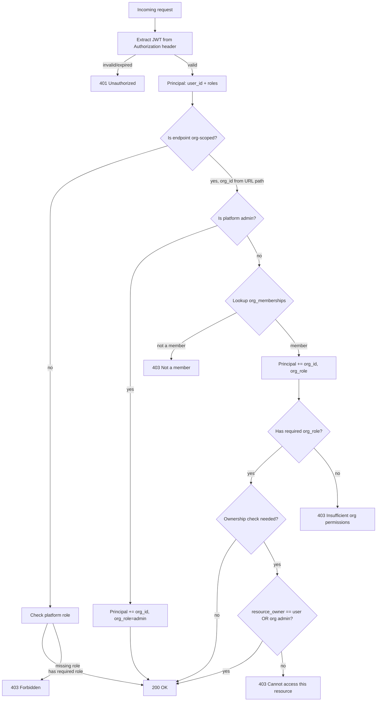

# Week 5: Identity & Access Architectures

This document is the implementation record for Week 5 deliverables:

- Auth model with diagrams
- Threat considerations
- RBAC test matrix summary

## Auth model

### Two-level role system

The platform separates **platform roles** (who you are globally) from
**org roles** (what you can do within a specific organization).

| Level | Roles | Stored in | Carried by |
| ---- | ---- | ---- | ---- |
| Platform | `admin`, `user` | `users.roles` | JWT `roles` claim |
| Org | `owner`, `admin`, `instructor`, `learner` | `org_memberships.org_role` | `Principal.org_role` (per-request) |

Platform roles are baked into the JWT at token issuance.
Org roles are resolved at request time from `org_memberships`.

### Principal resolution



### Key design decision: org context at request time

`org_id` is **not** baked into the JWT. Instead:

- JWT stays lean: `sub`, `roles` (platform-level), `scope`
- Org context comes from the URL path (`/v1/orgs/{org_id}/...`)
- Membership is verified per-request via `OrgMembershipRepo.get(org_id, user_id)`
- Principal is enriched with `org_id` + `org_role` via a dependency

Why:

- **Immediate revocation.** Removing a membership takes effect on the next request, not after token expiry.
- **No token reissue to switch orgs.** A user in three orgs uses one token.
- **One extra DB lookup per request.** This is a primary key lookup on `(org_id, user_id)` — cacheable with Redis in Week 6.

## Role hierarchy

| Level | Role | Capabilities |
| ---- | ---- | ---- |
| Platform | `admin` | Bypass all org membership checks. Manage users. Full system access. |
| Platform | `user` | Authenticate. Join orgs. Access own profile. |
| Org | `owner` | All admin powers + change member roles + delete org. |
| Org | `admin` | Add/remove members, manage courses, view all learner data in the org. |
| Org | `instructor` | Create/edit courses, view learner progress in own courses, list members. |
| Org | `learner` | Enroll in courses, view own progress, earn credentials. |

## Ownership-based access

For endpoints that target a specific user's resource (profile, progress):

1. If `principal.user_id == resource_owner_id` — allow (self-access).
2. If `principal.is_platform_admin()` — allow (admin override).
3. If `principal.org_role in ("admin", "owner")` — allow (org admin override, when in org context).
4. Otherwise — 403.

This is implemented as explicit function calls (`check_owner_or_admin`,
`check_owner_or_org_admin`) in `app/api/access.py`, not as FastAPI
dependencies, because ownership checks require both the Principal and
a resource identifier.

## Dependency composition

```mermaid
require_user
  └─ extracts JWT → Principal(user_id, roles)

resolve_org_principal(membership_repo)
  └─ reads org_id from path
  └─ depends on require_user
  └─ looks up membership → Principal(user_id, roles, org_id, org_role)

require_org_role(role, membership_repo)
  └─ depends on resolve_org_principal
  └─ checks org_role → 403 if insufficient

require_any_org_role(roles, membership_repo)
  └─ depends on resolve_org_principal
  └─ checks org_role in set → 403 if insufficient
```

## Threat considerations

| Threat | Mitigation |
| ---- | ---- |
| **Tenant data leakage** | All org-scoped repos require `org_id` in every query. No cross-org read methods in default repo Protocol. Tenant isolation tests verify org A member cannot access org B. |
| **Privilege escalation via role parameter** | `org_role` comes from DB lookup, never from client input on protected endpoints. Only owners can change roles. `add_member` validates role against allowlist. |
| **IDOR on profile endpoints** | `check_owner_or_admin()` enforced on every user-targeted endpoint. Tests cover self-access, admin access, and cross-user rejection. |
| **JWT claim manipulation** | `org_id` is NOT in the JWT. Org context is resolved from DB at request time. JWT is ES256-signed (asymmetric, not forgeable without private key). |
| **Membership revocation delay** | Because membership is checked per-request (not cached in JWT), revocation is immediate. No stale session window. |
| **Platform admin abuse** | Platform admin actions are explicit in code (auditable). Admin bypass of org membership is logged at warning level. |
| **Role confusion (platform vs org)** | Separate fields: `roles` (platform, frozenset) vs `org_role` (org, string). Type system prevents mixing. Different dependency chains for each. |
| **Token reuse across orgs** | Acceptable by design — one token works for all orgs. Membership check at request time prevents access to orgs the user doesn't belong to. |

## RBAC test matrix summary

### Platform-level tests (`test_rbac.py`)

| Endpoint | Method | `user` | `admin` | anon |
| ---- | ---- | ---- | ---- | ---- |
| `/resource/me` | GET | 200 | 200 | 401 |
| `/admin/users` | GET | 403 | 200 | 401 |
| `/users` | GET | 403 | 200 | 401 |
| `/users` | POST | 403 | 201 | 401 |
| `/auth/me` | GET | 200 | 200 | 401 |
| `/v1/orgs` | POST | 201 | 201 | 401 |

### Org-level tests (`test_org_rbac.py`)

| Endpoint | Method | owner | admin | instructor | learner | non-member | platform admin | anon |
| ---- | ---- | ---- | ---- | ---- | ---- | ---- | ---- | ---- |
| `GET /v1/orgs/{id}` | GET | 200 | 200 | 200 | 200 | 403 | 200 | 401 |
| `GET /v1/orgs/{id}/members` | GET | 200 | 200 | 200 | 403 | 403 | 200 | 401 |
| `POST /v1/orgs/{id}/members` | POST | 201 | 201 | 403 | 403 | 403 | 201 | 401 |
| `PATCH /v1/orgs/{id}/members/{uid}` | PATCH | 200 | 403 | — | — | — | — | — |
| `DELETE /v1/orgs/{id}/members/{uid}` | DELETE | 204 | — | — | 403 | — | — | — |

### Ownership tests (`test_ownership.py`)

| Endpoint | Method | self | admin (other) | user (other) |
| ---- | ---- | ---- | ---- | ---- |
| `PATCH /users/{id}` | PATCH | 200 | 200 | 403 |

### Tenant isolation tests (`test_tenant_isolation.py`)

- Org A member cannot GET org B details → 403
- Org A admin cannot POST members to org B → 403
- Org A instructor cannot GET org B member list → 403
- Platform admin can access any org → 200
- Creating org A does not grant access to org B → 403

## Files

### Modified

- `app/models/principal.py` — added `org_id`, `org_role`, `has_org_role()`, `has_any_org_role()`, `is_platform_admin()`
- `app/api/dependencies.py` — added `resolve_org_principal`, `require_org_role`, `require_any_org_role`
- `app/repos/user_repo.py` — added `get_by_id`, `update_name` to Protocol + InMemory
- `app/repos/pg_user_repo.py` — added `get_by_id`, `update_name` to Pg impl
- `app/main.py` — registered `orgs_router`, `profile_router`
- `tests/conftest.py` — added org fixture helpers
- `tests/api/test_rbac.py` — extended with `/auth/me` and `/v1/orgs` cases

### Created

- `app/repos/org_repo.py` — OrgRepo Protocol + InMemoryOrgRepo
- `app/repos/org_membership_repo.py` — OrgMembershipRepo Protocol + InMemoryOrgMembershipRepo
- `app/api/access.py` — `check_owner_or_admin`, `check_owner_or_org_admin`
- `app/api/orgs.py` — org management endpoints (`/v1/orgs`)
- `app/api/profile.py` — profile endpoints (`/auth/me`, `PATCH /users/{id}`)
- `tests/api/test_org_rbac.py` — table-driven org-scoped RBAC tests
- `tests/api/test_ownership.py` — ownership access control tests
- `tests/api/test_tenant_isolation.py` — cross-tenant isolation tests
