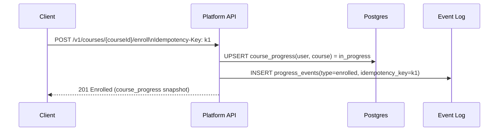
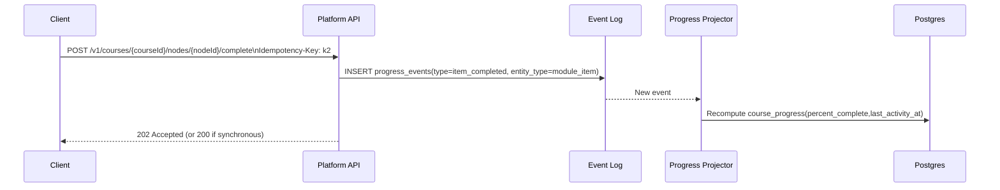
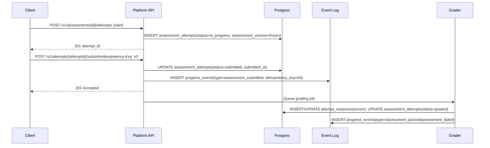
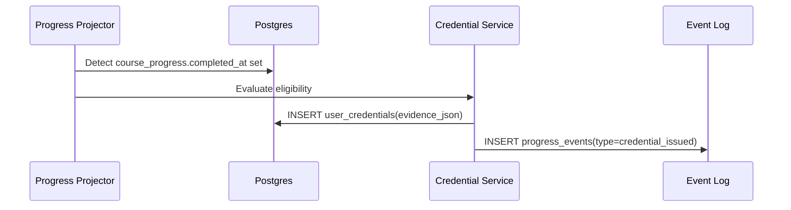

# Week 4: Data Modeling & Platform APIs

This document is the implementation draft for Week 4 deliverables:

- ER model with legend
- Four core sequence diagrams
- Data store map (now and later)
- API versioning, idempotency, and schema evolution notes

## Scope and design rules

- Tenant boundary: users are global identities; org access is through `org_memberships`.
- API baseline: all new endpoints are under `/v1`.
- Progress tracking: append-only event log (`progress_events`) plus read projection (`course_progress`).
- Mutating operations that can be retried require idempotency keys.

## Entity-Relationship (ER) model

```mermaid
erDiagram
    ORGANIZATIONS ||--o{ ORG_MEMBERSHIPS : has_members
    USERS ||--o{ ORG_MEMBERSHIPS : belongs_to

    ORGANIZATIONS ||--o{ COURSES : owns
    COURSES ||--o{ COURSE_MODULES : contains
    COURSE_MODULES ||--o{ MODULE_ITEMS : contains

    ORGANIZATIONS ||--o{ LEARNING_PATHWAYS : owns
    LEARNING_PATHWAYS ||--o{ PATHWAY_COURSES : includes
    COURSES ||--o{ PATHWAY_COURSES : included_in

    ORGANIZATIONS ||--o{ ASSESSMENTS : scopes
    COURSES ||--o{ ASSESSMENTS : may_have
    ASSESSMENTS ||--o{ ASSESSMENT_ITEMS : defines
    ORGANIZATIONS ||--o{ ASSESSMENT_ATTEMPTS : scopes
    USERS ||--o{ ASSESSMENT_ATTEMPTS : makes
    ASSESSMENTS ||--o{ ASSESSMENT_ATTEMPTS : attempted_as
    ASSESSMENT_ATTEMPTS ||--o{ ATTEMPT_RESPONSES : has

    ORGANIZATIONS ||--o{ PROGRESS_EVENTS : scopes
    USERS ||--o{ PROGRESS_EVENTS : emits
    COURSES ||--o{ PROGRESS_EVENTS : referenced_by
    ORGANIZATIONS ||--o{ COURSE_PROGRESS : scopes
    USERS ||--o{ COURSE_PROGRESS : has
    COURSES ||--o{ COURSE_PROGRESS : tracked_for

    ORGANIZATIONS ||--o{ CREDENTIALS : defines
    CREDENTIALS ||--o{ USER_CREDENTIALS : issued_as
    ORGANIZATIONS ||--o{ USER_CREDENTIALS : scopes
    USERS ||--o{ USER_CREDENTIALS : earns

    ORGANIZATIONS ||--o{ AI_SESSIONS : scopes
    USERS ||--o{ AI_SESSIONS : initiates
    MODULE_ITEMS ||--o{ AI_SESSIONS : context_for
    AI_SESSIONS ||--o{ AI_INTERACTIONS : contains
    AI_INTERACTIONS ||--o{ AI_FEEDBACK : rated_by

    ORGANIZATIONS {
      uuid id PK
      string name
      string slug UK
      string plan
      string status
    }

    USERS {
      uuid id PK
      string email UK
      string password_hash
      string name
      string[] roles
      bool is_active
    }

    ORG_MEMBERSHIPS {
      uuid org_id FK
      uuid user_id FK
      string org_role
      PK "(org_id, user_id)"
    }

    COURSES {
      uuid id PK
      string slug UK
      string title
      string status
      int version
      uuid created_by FK
      uuid org_id FK nullable
    }

    COURSE_MODULES {
      uuid id PK
      uuid course_id FK
      int position
      string title
      UK "(course_id, position)"
    }

    MODULE_ITEMS {
      uuid id PK
      uuid module_id FK
      string type
      uuid ref_id nullable
      int position
      UK "(module_id, position)"
    }

    LEARNING_PATHWAYS {
      uuid id PK
      uuid org_id FK nullable
      string slug UK
      string title
      string status
      int version
    }

    PATHWAY_COURSES {
      uuid pathway_id FK
      uuid course_id FK
      int position
      PK "(pathway_id, course_id)"
    }

    ASSESSMENTS {
      uuid id PK
      uuid org_id FK nullable
      uuid course_id FK nullable
      string type
      int version
      string scoring_model
    }

    ASSESSMENT_ITEMS {
      uuid id PK
      uuid assessment_id FK
      string kind
      string prompt
      int max_score
      int position
    }

    ASSESSMENT_ATTEMPTS {
      uuid id PK
      uuid org_id FK
      uuid assessment_id FK
      int assessment_version
      uuid user_id FK
      string status
      timestamptz started_at
      timestamptz submitted_at nullable
      timestamptz graded_at nullable
      int attempt_no
    }

    ATTEMPT_RESPONSES {
      uuid attempt_id FK
      uuid assessment_item_id FK
      json response_json
      int score nullable
      PK "(attempt_id, assessment_item_id)"
    }

    PROGRESS_EVENTS {
      uuid id PK
      uuid org_id FK
      uuid user_id FK
      uuid course_id FK
      timestamptz occurred_at
      string type
      string entity_type nullable
      uuid entity_id nullable
      json payload_json nullable
      string idempotency_key UK nullable
    }

    COURSE_PROGRESS {
      uuid org_id FK
      uuid user_id FK
      uuid course_id FK
      string status
      int percent_complete
      timestamptz last_activity_at nullable
      timestamptz completed_at nullable
      PK "(user_id, course_id)"
    }

    CREDENTIALS {
      uuid id PK
      uuid org_id FK
      string type
      string name
      string issuer
      int version
    }

    USER_CREDENTIALS {
      uuid id PK
      uuid org_id FK
      uuid user_id FK
      uuid credential_id FK
      timestamptz issued_at
      string status
      json evidence_json nullable
      UK "(user_id, credential_id, issued_at)"
    }

    AI_SESSIONS {
      uuid id PK
      uuid org_id FK
      uuid user_id FK
      uuid module_item_id FK nullable
      string session_type
      timestamptz started_at
      timestamptz ended_at nullable
    }

    AI_INTERACTIONS {
      uuid id PK
      uuid session_id FK
      string role
      string content_hash
      string model_id
      int input_tokens
      int output_tokens
      int latency_ms
      timestamptz created_at
    }

    AI_FEEDBACK {
      uuid interaction_id FK
      uuid user_id FK
      string rating
      string comment nullable
      PK "(interaction_id, user_id)"
    }
```

## Legend

- Authored content: `courses`, `course_modules`, `module_items`, `learning_pathways`, `pathway_courses`, `assessments`, `assessment_items`, `credentials`
- High-volume operational: `org_memberships`, `assessment_attempts`, `attempt_responses`, `progress_events`, `course_progress`, `ai_interactions`
- Audit/compliance: `user_credentials`, `ai_sessions`, `ai_feedback`

## Tenant isolation model (org-scoped)

- Global identity table: `users` has no `org_id`.
- Org membership and roles live in `org_memberships`.
- Organization ownership for authored content is represented via `courses.org_id`.
- Request authorization should resolve an active org from membership and enforce org-level access in service/repo queries.
- `user_credentials` uniqueness is `(user_id, credential_id, issued_at)` — re-issuance after revocation is allowed (new timestamp = new row).
- Pathway validation rules (no cross-course edges, no self-loops, reject prerequisite cycles) are enforced at the application layer, not via database constraints.

## Learning pathway model (current + extensible)

- Current codebase structure:
  - `course_modules` and `module_items` define in-course progression.
  - `learning_pathways` and `pathway_courses` define cross-course progression.
- This keeps naming and table shape aligned with current models.
- Optional extension later (without renaming existing tables):
  - add `pathway_node` and `pathway_edge` for richer branching constraints.

## Sequence diagrams (4 core flows)

### 1) Enroll



### 2) Complete module item



### 3) Assessment attempt (start -> submit -> grade)



### 4) Credential issuance



## Event sourcing contract for progress

Event store table: `progress_events`

Canonical event types:

- `enrolled`
- `item_completed`
- `assessment_submitted`
- `assessment_passed`
- `assessment_failed`
- `credential_issued`

Rules:

- Events are immutable and append-only.
- Use server-side `occurred_at` for ordering.
- Include `idempotency_key` for retriable writes.
- Projection rebuild must be deterministic from event stream.

Projection table: `course_progress`

- Fast read model for learner progress APIs.
- May be recreated from events if projection logic changes.

## API versioning and idempotency notes

Versioning:

- Route prefix strategy: `/v1/...`
- Additive changes allowed inside a version.
- Breaking changes require `/v2/...`.

Idempotency:

- Required for retriable mutations:
  - enroll
  - complete module item event append
  - assessment attempt submit
  - credential issuance
- Header: `Idempotency-Key`.
- Store per-tenant key with response hash and status code.
- Duplicate request with same semantic payload returns original result.
- Duplicate key with different payload returns conflict.

## Data store map (what lives where and why)

### PostgreSQL (now)

System of record for all Week 4 entities.

Lives here now:

- Organizations, users, org memberships
- Courses, modules/items, learning pathways/pathway courses
- Assessments, items, attempts, and attempt responses
- Progress event log (`progress_events`) and projection (`course_progress`)
- Credentials and issued credentials (`user_credentials`)
- AI session/interactions/feedback metadata and content references

Why:

- Relational integrity, transactional writes, auditable event history.

### Redis (introduced later)

Lives here later:

- Hot read caches for `course_progress`
- Rate limit counters
- Session/token blacklist support

Why:

- Low-latency reads/writes for high-frequency access patterns.

### Object store (introduced later)

Lives here later:

- Large AI conversation artifacts and assessment attachments
- Prompt templates and generated outputs (referenced by hash/id)

Why:

- Cost-effective storage for large blobs and immutable artifacts.

### Vector store (introduced later)

Lives here later:

- Embeddings for retrieval over course/assessment/support content

Why:

- Semantic search and retrieval-augmented generation workflows.

## Schema evolution notes (expand/contract)

Expand:

- Add new nullable columns or new tables.
- Start dual-write if replacing a field/table.
- Keep old readers/writers functional.

Migrate:

- Backfill existing rows in batches.
- Add indexes/constraints after backfill where needed.

Contract:

- Move reads to new schema paths.
- Remove dual-write.
- Drop old columns/tables in a later migration.

Operational safeguards:

- All migrations reversible where practical.
- Gate destructive schema changes behind explicit deploy phases.
- For projection logic changes, support rebuild from `progress_events`.

## Week 4 definition of done

- ER model completed with legend categories.
- Four sequence diagrams written and reviewed.
- Data store map documented with current/future rationale.
- Schema evolution and idempotency rules documented.
- API docs updated to reflect `/v1` and idempotency requirements.
