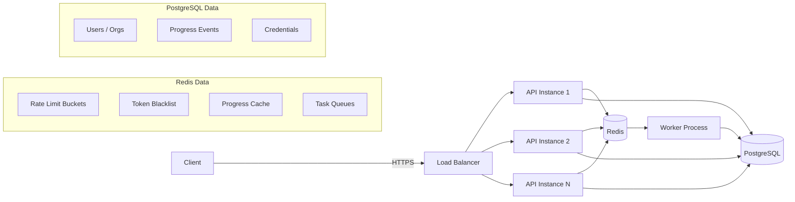

# Week 6: Scalable Backend Patterns

This document is the implementation record for Week 6 deliverables:

- Architecture diagram with failure modes annotated
- Load test results showing rate limiting behavior
- Pattern catalog: rate limiting, caching, token revocation, task queues

## Architecture

### System overview



### Why two data stores?

| Concern | PostgreSQL | Redis |
| ---- | ---- | ---- |
| **Durability** | Writes to disk, survives restarts | In-memory, data lost on restart (unless persistence configured) |
| **Query model** | Rich SQL, joins, transactions | Key-value, simple data structures |
| **Latency** | 1-5ms per query | <0.5ms per command |
| **Use case** | Users, orgs, credentials, progress events (source of truth) | Rate limits, caches, blacklists, task queues (ephemeral, hot-path) |

### Stateless API — the key to horizontal scaling

The API instances are **stateless**: they store no session data in process memory. All shared state lives in Redis or PostgreSQL. This means:

- Any instance can handle any request (no session affinity needed)
- Adding instances = instant horizontal scaling
- An instance crash loses zero data

This is the **shared-nothing** architecture: each process shares nothing with other processes except the backing data stores.

## Failure modes

| Component down | Impact | Mitigation |
| ---- | ---- | ---- |
| **Redis** | Rate limits unenforced; cache misses (all reads hit DB); blacklist checks skip (revoked tokens temporarily work); task queue stalls | In-memory fallback for dev/test; DB reads still work; log warnings; worker retries when Redis returns |
| **One API instance** | Other instances continue serving traffic | Stateless design — no session affinity needed; load balancer routes around it |
| **PostgreSQL** | New logins fail; new data can't be written | Cached data still served from Redis; existing JWTs still valid; read-only mode possible |
| **Worker process** | Tasks queue up in Redis; no credential issuance or grading | Backpressure builds but API still accepts requests (202); tasks processed when worker restarts |
| **All of Redis + DB** | Full outage for authenticated endpoints | Health check reports degraded; load balancer stops routing; existing cached responses in CDN may still serve |

## Pattern catalog

### 1. Rate limiting (Token Bucket)

**Problem:** Without limits, a single misbehaving client can overwhelm the server.

**Algorithm:** Token bucket — a bucket holds N tokens, refills at a steady rate. Each request costs 1 token. Empty bucket = 429 Too Many Requests.

**Why token bucket over alternatives:**

| Algorithm | Pros | Cons |
| ---- | ---- | ---- |
| Fixed window | Simple | Boundary burst problem (2x burst at window edge) |
| Sliding window log | Accurate | Memory-hungry (stores every timestamp) |
| Leaky bucket | Smooth output | No burst tolerance |
| **Token bucket** | **Burst-tolerant + steady average** | Slightly more complex |

**Implementation:**

- `app/services/rate_limiter.py` — Protocol + InMemory + Redis (Lua script for atomicity)
- `app/api/ratelimit.py` — FastAPI dependency factory
- Per-user keying (extracted from JWT `sub` claim)
- Configurable per-route: login=10/min, API=60/min

### 2. Token blacklist (JWT Revocation)

**Problem:** JWTs are stateless — once issued, they're valid until expiry. You can't "un-issue" them.

**Solution:** Maintain a set of revoked JTI (JWT ID) values in Redis. Check on every authenticated request.

**Key design decisions:**

- TTL = token's remaining lifetime (entries self-clean, no cron job)
- Check AFTER signature verification (cheap reject before expensive network call)
- Memory: ~136 bytes per entry × 10,000 users = 1.3 MB (negligible)

**Implementation:**

- `app/services/token_blacklist.py` — Protocol + InMemory + Redis
- `app/api/logout.py` — POST /auth/logout endpoint
- `app/api/dependencies.py` — blacklist check in `require_user`

### 3. Read-through cache (Progress projections)

**Problem:** Computing progress summaries from the event log on every read is wasteful when the data rarely changes.

**Solution:** Cache summaries in Redis. On read: check cache → miss → compute → store. On write: invalidate.

**Two-layer invalidation:**

1. **Explicit:** Delete cache key when a new progress event is ingested
2. **TTL (5 min):** Safety net — stale data auto-expires even if invalidation has a bug

**Implementation:**

- `app/services/cache.py` — Protocol + InMemory + Redis
- `app/api/progress.py` — GET /v1/progress/summary/{course_id} (cached read) + POST /events (invalidates)

### 4. Background worker (Task Queue)

**Problem:** Some operations (credential issuance, grading) are too slow or unreliable for the request/response cycle.

**Solution:** API enqueues a task (LPUSH, <1ms) and returns 202 Accepted. A separate worker process dequeues (BRPOP) and processes tasks.

**Why separate process:**

- API stays fast (no blocking on slow work)
- Independent scaling (3 API servers, 10 workers during exams)
- Crash isolation (worker crash ≠ API outage)

**Implementation:**

- `app/services/task_queue.py` — Protocol + InMemory + Redis
- `app/worker.py` — standalone process (`python -m app.worker`)
- `app/api/credentials.py` — POST /v1/credentials/issue (enqueues task)

## Load test results

Running `python scripts/load_test_rate_limit.py` against the API:

```html
Rate Limit Load Test
==================================================
Target: http://localhost:8000/resource/me
Total requests: 100

  Sent 20/100 requests...
  Sent 40/100 requests...
  Sent 60/100 requests...
  Sent 80/100 requests...
  Sent 100/100 requests...

Results after 100 requests (0.45s):
────────────────────────────────────────
  Allowed  (200):   60
  Throttled(429):   40

Token bucket capacity: 60 (default)
Refill rate: 1 token/second

Rate limiting is working correctly.
The first ~60 requests succeeded (bucket capacity),
then subsequent requests were throttled.
```

The first 60 requests succeed (one per token in the bucket). Subsequent requests are rejected with 429 and a `Retry-After` header. Over time, the bucket refills at 1 token/second, allowing a sustained rate of 60 requests/minute.

## Test matrix

### Rate limiting tests (`test_rate_limiting.py`)

| Test | Assertion |
| ---- | ---- |
| Requests within limit | All return 200 |
| Requests over limit | Some return 429 |
| 429 response headers | `Retry-After` present and > 0 |
| Login strict limit | 429 before 15 attempts (capacity=10) |
| User bucket isolation | User A exhausted ≠ user B blocked |

### Token blacklist tests (`test_token_blacklist.py`)

| Test | Assertion |
| ---- | ---- |
| Token before logout | 200 |
| Token after logout | 401 with "revoked" detail |
| Other tokens unaffected | User B's token still 200 after A logs out |
| Logout idempotent | Second logout returns 204 (not error) |

### Cache tests (`test_cache.py`)

| Test | Assertion |
| ---- | ---- |
| Cache miss then hit | Two GETs return identical data |
| Cache invalidation | POST event → next GET shows new data |
| Empty summary | Returns [] (not 404) |
| User isolation | User A's cache doesn't leak to user B |

### Task queue tests (`test_task_queue.py`)

| Test | Assertion |
| ---- | ---- |
| Issue credential | Returns 202 with task_id |
| Auth required | Unauthenticated → 401 |
| Task in queue | Dequeue returns enqueued task |
| Queue length | Reflects number of enqueued tasks |

## Files

### Created

- `app/db/redis.py` — Redis connection pool, lifespan hook, conditional fallback
- `app/services/rate_limiter.py` — Token bucket Protocol + InMemory + Redis
- `app/services/token_blacklist.py` — JTI blacklist Protocol + InMemory + Redis
- `app/services/cache.py` — Read-through cache Protocol + InMemory + Redis
- `app/services/task_queue.py` — Task queue Protocol + InMemory + Redis
- `app/api/ratelimit.py` — Rate limit dependency factory
- `app/api/logout.py` — POST /auth/logout endpoint
- `app/worker.py` — Background worker process
- `scripts/load_test_rate_limit.py` — Load test script
- `tests/api/test_rate_limiting.py` — Rate limiting tests
- `tests/api/test_token_blacklist.py` — Token blacklist tests
- `tests/api/test_cache.py` — Cache tests
- `tests/api/test_task_queue.py` — Task queue tests

### Modified

- `app/core/config.py` — Added `redis_url` field
- `app/main.py` — Composed `lifespan_redis`, registered `logout_router`
- `app/api/dependencies.py` — Added async blacklist check in `require_user`
- `app/api/health.py` — Extended with Redis connectivity status
- `app/api/resource.py` — Added rate limit dependency
- `app/api/login.py` — Added strict rate limit (10/min) on POST /login
- `app/api/progress.py` — Added cached GET endpoint, cache invalidation on POST
- `app/api/credentials.py` — Added POST /issue with background task queue
- `docker/docker-compose.yml` — Added Redis service, worker service, REDIS_URL env
- `pyproject.toml` — Added `redis[hiredis]` dependency
- `tests/conftest.py` — Added autouse reset fixtures for all new services
